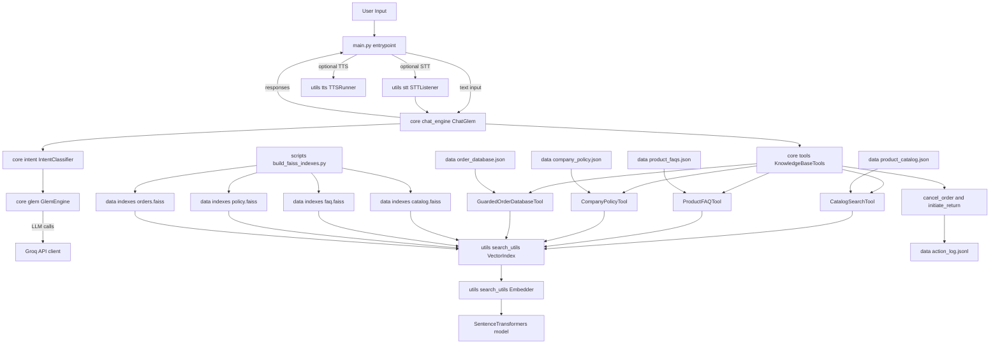
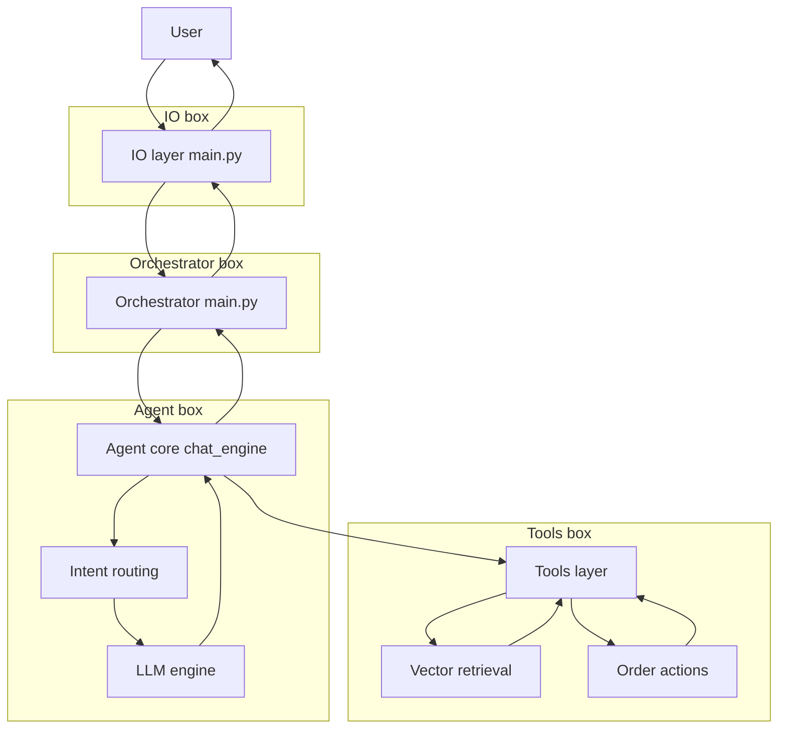
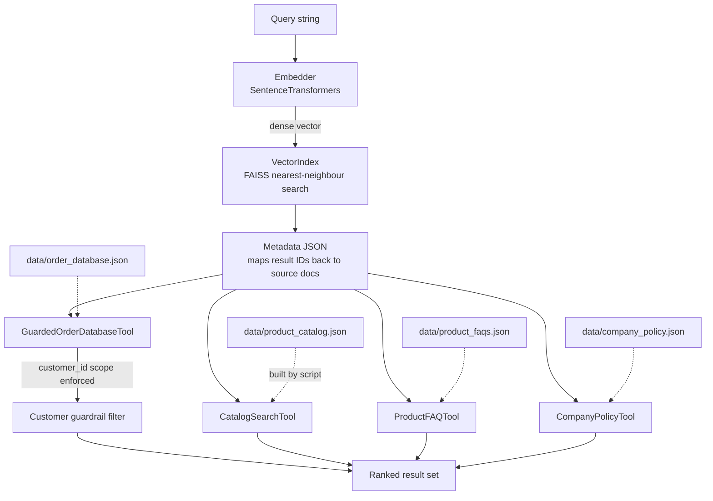

# Glem

## Table of Contents

1. [High-Level Overview](#1-high-level-overview)
2. [Layer Breakdown](#2-layer-breakdown)
3. [Component Reference](#3-component-reference)
4. [Data Flow](#4-data-flow)
5. [Retrieval Pipeline](#5-retrieval-pipeline)
6. [Worked Example: Order Status Query](#6-worked-example-order-status-query)
7. [Data & Index Inventory](#7-data--index-inventory)
8. [Build & Tooling](#8-build--tooling)


## 1. High-Level Overview

Glem is a conversational customer-support agent. A user message enters through the IO layer, is routed by an intent classifier, and is either answered directly by an LLM or enriched with knowledge retrieved from local FAISS vector indexes before a final response is generated. Mutative actions such as order cancellation and return initiation are gated behind customer-scoped guardrails and appended to a persistent action log.




## 2. Layer Breakdown



The system is divided into four distinct layers. Each layer has a single, well-defined responsibility.

**IO Layer** (`main.py`) — Entry and exit point for every interaction. Wires together the optional speech-to-text input, the optional text-to-speech output, and the core orchestration loop. No business logic lives here.

**Orchestrator** (`main.py` → `main()`) — Constructs the three primary runtime objects — `IntentClassifier`, `ChatGlem`, and `KnowledgeBaseTools` — and hands control to the agent loop. It also sets up any STT/TTS peripherals before the first turn.

**Agent** (`core/chat_engine.py` → `ChatGlem`) — The central control loop. On every turn it classifies intent, decides whether to hit the tools layer or go directly to the LLM, assembles the context window, calls the LLM, and emits the response. All turn-level orchestration logic lives here.

**Tools Layer** (`core/tools.py` → `KnowledgeBaseTools`) — Provides two categories of capability to the agent: *retrieval* (read-only vector search across four knowledge bases) and *actions* (state-changing order operations with guardrails and logging).


## 3. Component Reference

| Component | File | Role |
|---|---|---|
| `ChatGlem` | `core/chat_engine.py` | Main agent loop; inherits from `GlemEngine` |
| `GlemEngine` | `core/glem.py` | LLM client wrapper; owns `_get_client()` and `generate()` |
| `IntentClassifier` | `core/intent.py` | Classifies raw user input into a routing plan via LLM |
| `KnowledgeBaseTools` | `core/tools.py` | Dispatcher for all retrieval and action tools |
| `CatalogSearchTool` | `core/tools.py` | Vector search over the product catalog |
| `ProductFAQTool` | `core/tools.py` | Vector search over product FAQs |
| `CompanyPolicyTool` | `core/tools.py` | Vector search over company policies |
| `GuardedOrderDatabaseTool` | `core/tools.py` | Vector search over orders, scoped to the authenticated customer |
| `VectorIndex` | `utils/search_utils.py` | Thin wrapper around a FAISS index + metadata JSON |
| `Embedder` | `utils/search_utils.py` | Sentence-Transformers embedding model |
| `STTListener` | `utils/stt.py` | Optional speech-to-text input |
| `TTSRunner` | `utils/tts.py` | Optional text-to-speech output |
| Groq API | external | Cloud LLM endpoint called by `GlemEngine` |


## 4. Data Flow

The following sequence describes exactly what happens on a single turn, from raw input to emitted response.

**Step 1 — Input.** `main.main()` reads text from `input()` or from `STTListener` if speech input is enabled.

**Step 2 — Short-circuit checks.** Before any LLM call, `ChatGlem.run()` evaluates two lightweight helpers: `_is_customer_id_question()` and `_is_purchase_intent()`. If either matches, a canned response is returned immediately.

**Step 3 — Intent classification.** `IntentClassifier.classify(user_input)` sends the raw input to the LLM via `GlemEngine.generate()`. The LLM returns a structured JSON plan that includes a route (`tools` or `llm`), the detected intent, any tool calls to execute, and a confidence score.

**Step 4 — Plan post-processing.** Two helpers adjust the plan after classification: `_ensure_order_tool_call()` forces an order-retrieval step whenever an order ID is detected in the input, and `_ensure_policy_tool_call()` forces a policy-retrieval step whenever a policy-related intent is detected.

**Step 5 — Tool execution (if routed to tools).** `_execute_tool_calls()` dispatches each tool call through `KnowledgeBaseTools.execute_tool_call()`. The tool dispatcher resolves the `mode` field (`catalog`, `faq`, `policy`, or `orders`) and delegates to the corresponding tool's `.retrieve()` or `.search()` method. For order tools, `GuardedOrderDatabaseTool` enforces that only records belonging to the authenticated `customer_id` are returned.

**Step 6 — Retrieval context assembly.** A set of private helpers on `ChatGlem` processes raw tool output into structured context: `_get_retrieve_query()` extracts the query, `_resolve_generic_order_query()` normalises generic references to specific order IDs, `_get_catalog_matches()` and `_get_order_matches()` shape the results, and `_extract_order_id()` pulls an explicit order identifier when present.

**Step 7 — Special-case handling.** The agent checks for conditions that need a non-standard response path: a cancellation request with no order ID, ambiguous or missing catalog matches, and missing order matches. Each condition triggers its own response template or follow-up prompt.

**Step 8 — Context window.** The agent appends the current turn to `history`, injects any retrieval context as a system or user message, then calls `build_sliding_window()` to trim the history to the model's context limit.

**Step 9 — LLM call.** `ChatGlem.chat()` forwards the windowed messages to `GlemEngine._get_client()`, which calls `client.chat.completions.create()` on the Groq API.

**Step 10 — Post-processing and output.** `_needs_return_warning()` checks whether a return-related disclaimer should be appended. `_emit_response()` prints the final text, appends it to `history`, and optionally feeds it to `TTSRunner` for speech output. The loop then waits for the next turn, exiting only on a `quit` or `exit` command.


## 5. Retrieval Pipeline

All four knowledge-base tools share the same underlying retrieval mechanism.



Each tool owns one FAISS index file and one companion metadata file (see Section 7). Indexes are built offline by `scripts/build_faiss_indexes.py` and are not updated at runtime.


## 6. Worked Example: Order Status Query

This section traces a concrete request — *"Where is my order O0002"* — through every function in the stack.

`main.main()` instantiates `IntentClassifier`, `ChatGlem`, and `KnowledgeBaseTools(customer_id="C0029")`, then calls `chat_engine.run(...)`.

Inside `ChatGlem.run()`, the short-circuit checks both return `False`. The classifier is invoked and the LLM returns:

```json
{
  "route": "tools",
  "intent": "retrieve",
  "tool_calls": [
    { "tool": "retrieve", "args": { "query": "O0002", "mode": "orders", "k": 5 } }
  ],
  "use_memory": true,
  "confidence": 0.86
}
```

`_ensure_order_tool_call()` confirms the orders-retrieve call is already present; no change is made. Because the route is `tools`, `_execute_tool_calls()` dispatches to `KnowledgeBaseTools.execute_tool_call("retrieve", ...)`. The dispatcher sees `mode == "orders"` and delegates to `GuardedOrderDatabaseTool.search()`, which filters results to `customer_id="C0029"` and returns matching order details as a JSON string.

The retrieval-context helpers run next. `_get_retrieve_query()` produces `order_query="O0002"`. `_resolve_generic_order_query()` confirms the ID is explicit. `_get_order_matches()` returns the single matching order record. `_extract_order_id()` extracts `"O0002"`. None of the special-case branches fire — this is not a cancellation, and the order was found.

The turn is appended to `history`, `build_sliding_window()` trims context, and `ChatGlem.chat()` sends the assembled messages to Groq. The response comes back, `_needs_return_warning()` evaluates to `False`, and `_emit_response()` prints the answer to the user.


## 7. Data & Index Inventory

| Knowledge Base | Source Data | FAISS Index | Metadata |
|---|---|---|---|
| Product Catalog | `data/product_catalog.json` | `data/indexes/catalog.faiss` | `data/indexes/catalog_meta.json` |
| Product FAQs | `data/product_faqs.json` | `data/indexes/faq.faiss` | `data/indexes/faq_meta.json` |
| Company Policy | `data/company_policy.json` | `data/indexes/policy.faiss` | `data/indexes/policy_meta.json` |
| Order Database | `data/order_database.json` | `data/indexes/orders.faiss` | `data/indexes/orders_meta.json` |

Mutative order actions (cancellation, returns) are appended to `data/action_log.jsonl` as a durable audit trail.


## 8. Build & Tooling

**Index generation** — Run `scripts/build_faiss_indexes.py` to (re-)generate all four FAISS indexes from their source JSON files. This must be executed any time the underlying data changes. The script reads each source file, embeds every document with the same `Embedder` used at query time, and writes the `.faiss` index and companion `_meta.json` to `data/indexes/`.

**Optional I/O peripherals** — STT and TTS are both opt-in. `STTListener` is used as a context manager (`__enter__` / `__exit__`) and feeds recognised text into the same input path as the keyboard. `TTSRunner` is started with `.start()` before the agent loop and consumes text from `_emit_response()`.
