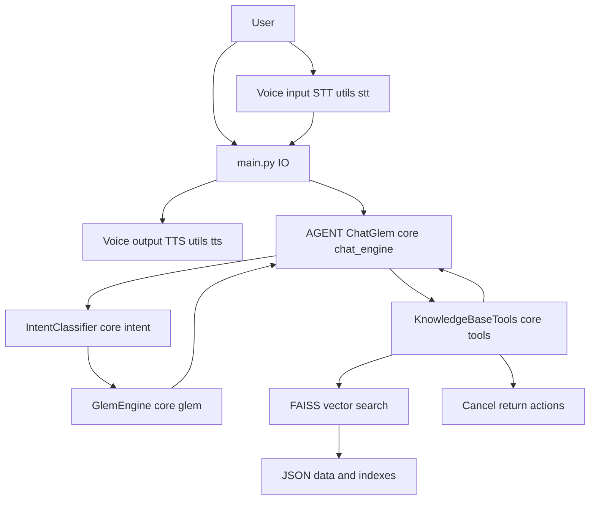

<p align="center">
  
</p>


# Glem

[](https://www.python.org/)
<a href="https://github.com/psf/black"></a>


An offline‑first e‑commerce assistant that pairs local vector search over JSON data with an LLM‑based router and response generator. It is designed for fast, deterministic retrieval while still producing natural responses, with optional speech input and speech output. For deeper architecture details, see [ARCHITECTURE.md](ARCHITECTURE.md).



## Core technologies
1. Python 3: Primary runtime for the assistant and tools.
2. Groq LLM API: Routing and response generation via `GlemEngine`.
3. FAISS: Vector similarity search over local indexes.
4. Sentence Transformers: Embeddings for catalog, FAQ, policy, and orders.
5. JSON data stores: Product catalog, FAQs, policies, and orders.
6. ElevenLabs (optional): Text-to-speech via `utils/tts.py`.

## Setup

### 1. Create a virtual environment
```bash
python -m venv .venv
source .venv/bin/activate
```

### 2. Install dependencies
```bash
pip install -r requirements.txt
```

### 3. Configure environment variables
Create a `.env` file in the project root or export variables in your shell.

Required:
1. `API_KEYS`: Comma‑separated Groq API keys used by `GlemEngine`.

Optional:
1. `USE_STT`: `1`, `true`, or `yes` to enable speech‑to‑text.
2. `USE_TTS`: `1`, `true`, or `yes` to enable text‑to‑speech.
3. `TTS_VOICE_ID`: ElevenLabs voice id.
4. `TTS_MODEL_ID`: ElevenLabs model id. Default `eleven_multilingual_v2` in `main.py`.
5. `TTS_OUTPUT_FORMAT`: e.g. `mp3_44100_128`.
6. `TTS_RATE`: Optional int for speech rate if your TTS backend supports it.
7. `ELEVENLABS_API_KEY` or `ELEVENLABS_API_KEYS`: Used by `utils/tts.py`.

### 4. Build vector indexes
The assistant expects FAISS indexes under `data/indexes/`.

```bash
python scripts/build_faiss_indexes.py --data-dir data --out-dir data/indexes
```

### 5. Run
```bash
python main.py
```

## How it works
1. `main.py` wires the system prompt, tools, intent classifier, and agent.
2. `core/chat_engine.py` runs the loop, calls tools, and crafts the final response.
3. `core/intent.py` uses `GlemEngine` with a JSON schema to decide tool vs chat routing.
4. `core/tools.py` handles retrieval, order actions, and tool execution.
5. `utils/search_utils.py` provides embeddings, FAISS index access, and query parsing.
6. `utils/stt.py` and `utils/tts.py` provide optional audio input/output.
7. `scripts/build_faiss_indexes.py` builds the indexes from JSON data.
See [ARCHITECTURE.md](ARCHITECTURE.md) for a full system diagram and component breakdown.

## Assumptions
1. Data lives in `data/` and is treated as the source of truth.
2. Indexes in `data/indexes/` are built before runtime.
3. A single customer context is active per run via `CUSTOMER_ID` in `main.py`.
4. The configured model string `openai/gpt-oss-20b` is available in Groq.
5. The assistant only acts on orders belonging to the active customer id.

## Limitations
1. No live data updates. You must rebuild indexes if JSON data changes.
2. Order actions do not mutate the order database; they only write to `data/action_log.jsonl`.
3. Tool calls and routing depend on the LLM; incorrect routing is possible.
4. Token budgeting uses a rough heuristic in `build_sliding_window`.
5. No streaming responses or concurrency controls.
6. Audio features require a working local audio device and the related packages.
7. Errors are surfaced as plain text; there is no structured error handling layer.

## Troubleshooting
1. Missing indexes: run `scripts/build_faiss_indexes.py`.
2. API errors: confirm `API_KEYS` is set and valid.
3. STT/TTS issues: disable with `USE_STT=0` or `USE_TTS=0` and verify dependencies.
